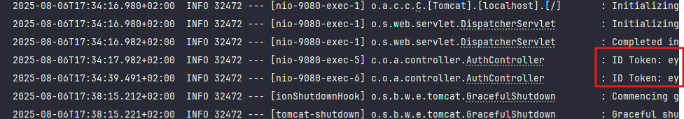
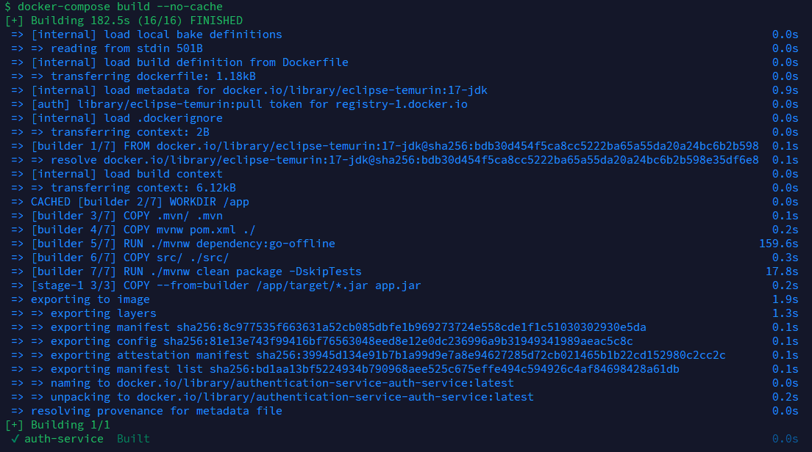
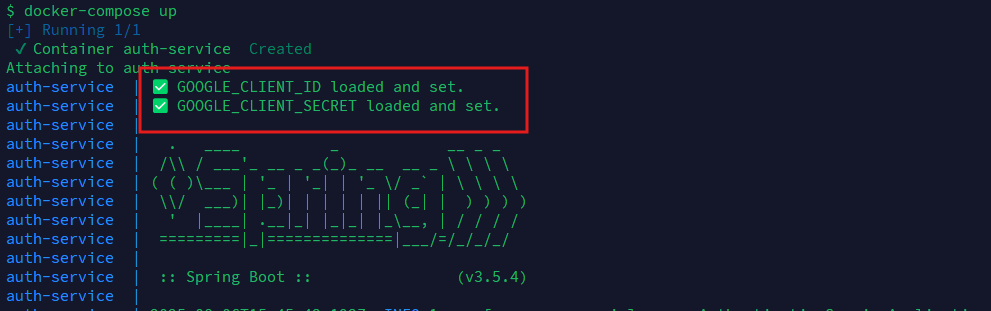
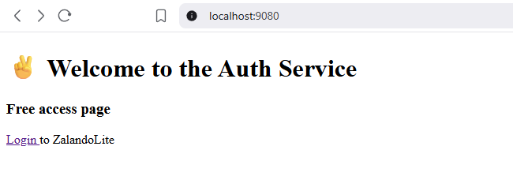
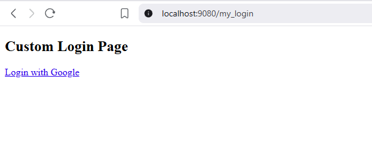
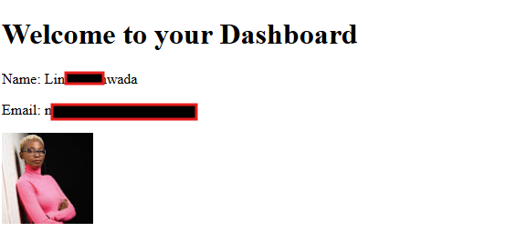

# 🔐 ZalandoLite V2 - Authentication

---
###   🔗 [ZalandoLite V2  🍀 Overview Repository ](https://github.com/Ochwada/ZalandoLiteV2-MicroservicesArchitecture)
 Microservices ⬇️ part of **ZalandoLite V2**
#### 🖇️ [Microservice 1: Authentication Service](https://github.com/Ochwada/ZalandoLiteV2-authentication)


---
##  About Authentication Service

The  **Authentication Service**, is a lightweight, modular microservice in the **ZalandoLite** ecosystem, purpose-built 
for handling user authentication via **OAuth2** with **Google** as the social login provider.

Developed with **Java 17+**, **Spring Boot**, and **Spring Security**, this service ensures a secure and extensible 
authentication flow, seamlessly integrable into modern microservice architectures.


##  Features

- OAuth2-based login using **Google**
- Secure, token-based authentication (**JWT-ready**)
- Modular and easily customizable for additional providers
- Plug-and-play integration with microservice ecosystems
- Built using **Spring Boot**, **Spring Security**, and **Java 17+**

## Project Structure
```yaml
authentication-service/
│
├── src/
│   ├── main/
│   │   ├── java/com/owr/authentication_service/
│   │   │   ├── config/             # Spring Security config
│   │   │   ├── controller/         # Auth controller endpoints
│   │   │   └── AuthenticationServiceApplication.java
│   │   └── resources/
│   │       ├── template/           # Thymeleaf templates
│   │       └── application.yml     # Configuration
│
├── .env                            # (optional) for secrets
├── README.md
├── pom.xml

```

## Tech Stack 
Unique tech stack  for this service:

| Technology          | Purpose                                                                      |
|---------------------|------------------------------------------------------------------------------|
| **Thymeleaf**       | Server-side HTML template engine used for rendering login/dashboard UI       |


### Dependencies
Unique Dependencies for this service: 

| Dependency Artifact                 | Purpose                                                                 |
|-------------------------------------|-------------------------------------------------------------------------|
| `thymeleaf-extras-springsecurity6`  | Integrates Spring Security with Thymeleaf (e.g., `sec:authorize`)       |


### Environment Configurations
The variables are defined  in a file located at:
```.dotenv
authentication-service/.env
```
> These credentials are used to authenticate users via Google OAuth2/OpenID Connect.

```.dotenv
#-------------------------------------------
#  Configuration
#-------------------------------------------
GOOGLE_CLIENT_ID=google_client_id
GOOGLE_CLIENT_SECRET=google_secret
```

Variable Reference

| Variable               | Description                                      | Where to Get It                                    |
|------------------------|--------------------------------------------------|----------------------------------------------------|
| `GOOGLE_CLIENT_ID`     | OAuth2 client ID for Google login                | From Google Cloud Console under OAuth2 credentials |
| `GOOGLE_CLIENT_SECRET` | Secret used to authenticate your app with Google | Same place as above (keep this secure!)            |


## API Endpoints
| Method | Endpoint                       | Auth Required | Description                                                          |
|--------|--------------------------------|---------------|----------------------------------------------------------------------|
| `GET`  | `/`                            | ❌ No          | Public home page (renders `home.html`)                               |
| `GET`  | `/my_login`                    | ❌ No          | Custom login page (renders `my_login.html` if defined)               |
| `GET`  | `/dashboard`                   | ✅ Yes         | User dashboard after successful login (renders `dashboard.html`)     |
| `GET`  | `/oauth2/authorization/google` | ❌ Redirect    | Triggers Google OAuth2 login via Spring Security                     |
| `GET`  | `/internal/token`              | ✅ Yes         | Internal endpoint to get the authenticated user's raw ID Token (JWT) |
| `GET`  | `/logout`                      | ✅ Yes         | Logs the user out                                                    |
                       |


## Results Overview
- Go to your browser and visit (not using docker):
```yaml
http://localhost:9080/oauth2/authorization/google
```


- To get the token , it will be logged in your terminal as shown below

---

## Dockerization



 - Running, this shows that the `.env `file is read  and the variables are fetched  and set successfully



- On the browser and visit (using docker):
```yaml
http://localhost:9080
```





## Credits
Made with ❤️ by [Linda Ochwada](https://www.linkedin.com/in/ochwada-l-66630a36/)

**ZalandoLite V2** is an educational microservice project focused on modern Java + Spring practices.